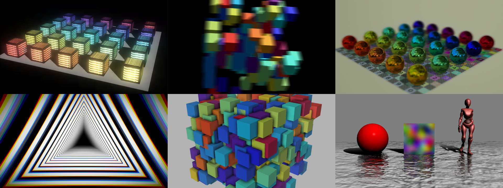
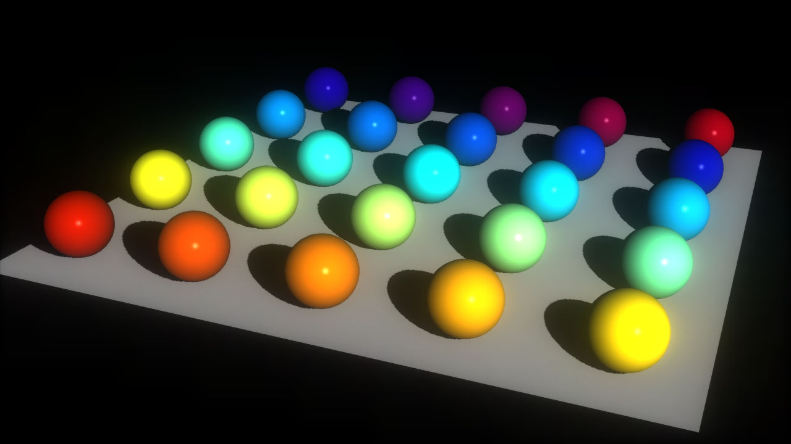
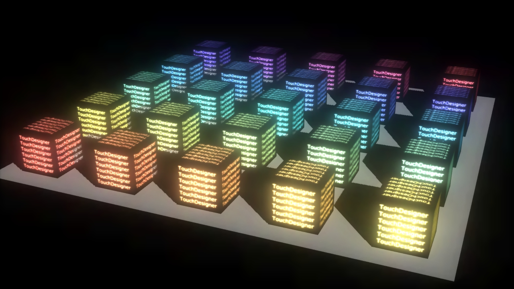
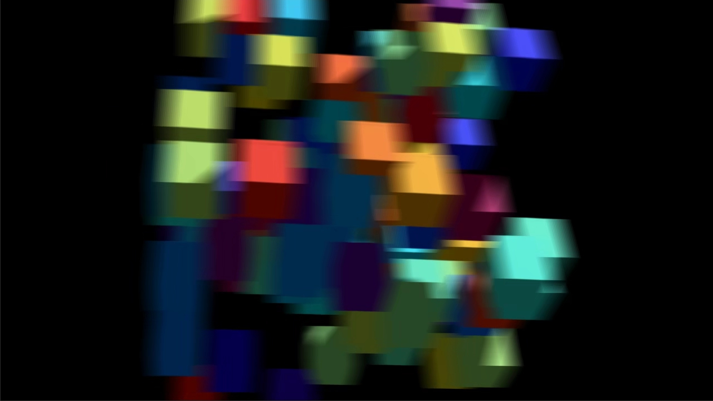
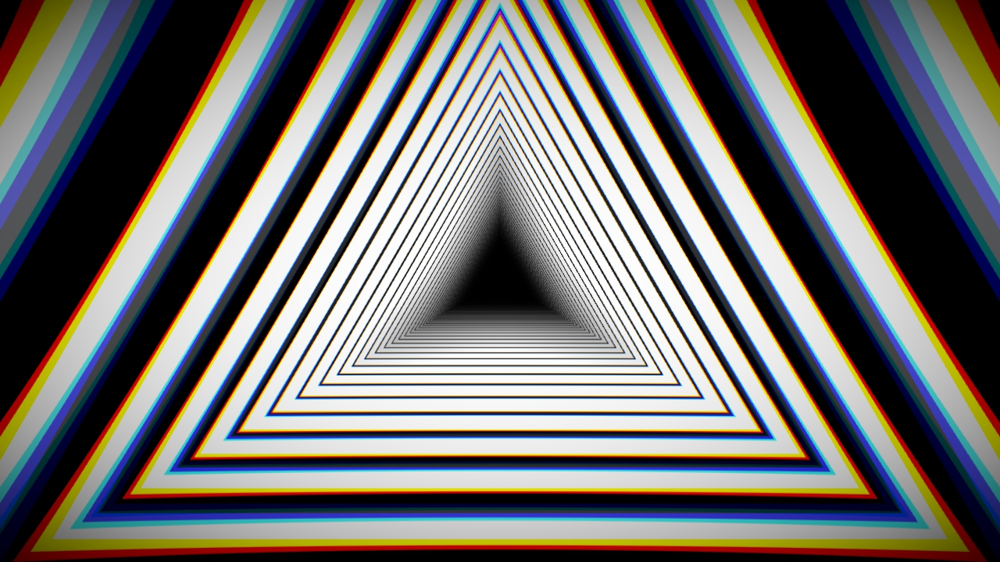
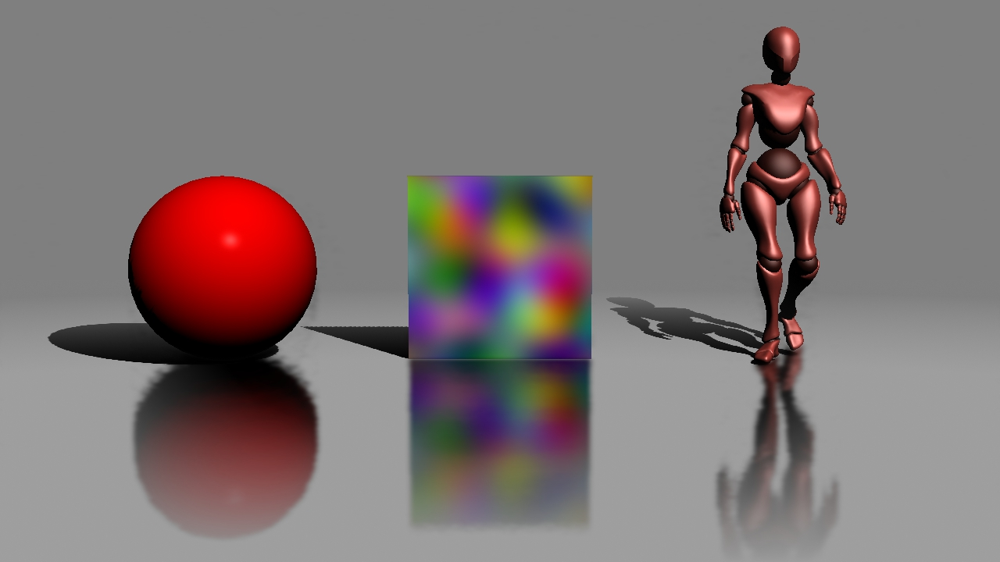
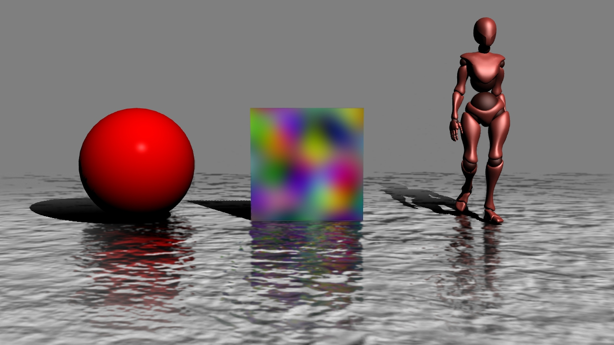
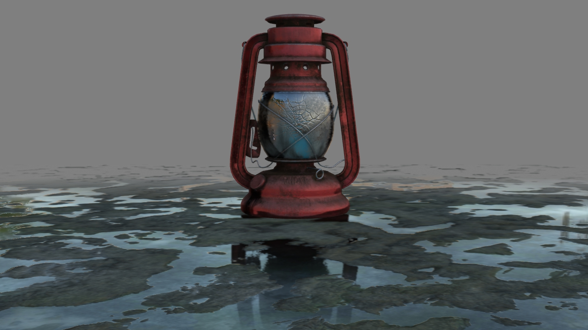

# TouchDesigner PostEffects

TouchDesigner用のPostEffectとして、以下のtox群を作成しました。
- Bloom  
- Camera Motion Blur
- Depth of Field
- Lens Effects
- Screen Space Ambient Occulusion
- Screen Space Reflection  

以下のGithubリポジトリよりダウンロードできます。  
[https://github.com/yasuhirohoshino/TouchDesigner_PostEffects](https://github.com/yasuhirohoshino/TouchDesigner_PostEffects)  
今後機能追加がある場合は、上記のリポジトリ上で公開していく予定です。  
TouchDesignerのバージョンは本記事作成時において最新である、`TouchDesigner 2020.20020`に対応しています。  
`Windows 10 Version 1909`でのみ開発・検証を行っています。

## Bloom

### Inputs
|Number|Necessity|Type|Name|Description|
|:---|:---|:---|:---|:---|
|0|Required|TOP|Source|Bloomを適用する画像|
|1|Optional|TOP|Emission_Map|Bloom適用時に参照するEmission Map|

### Parameters
|Parameter|Type|Description|
|:---|:---|:---|
|Threthould|Float|Bloomeエフェクトを開始する輝度|
|Intensity|Float|Bloomの強さ|
|Using Soft Knee Curve|Toggle|Soft Knee Curveを使用するかどうか|
|Soft Knee|Float|Soft Knee Curveの値|

### Usage
- `in 2` にEmission Mapを接続することで、特定の箇所に輝度値にかかわらずBloomをかけることが可能です。
- Soft Knee Curveを使用することで、ゆるやかなBloomを適用することが可能です。

## Camera Motion Blur

### Inputs
|Number|Necessity|Type|Name|Description|
|:---|:---|:---|:---|:---|
|0|Required|TOP|Source|Camera Motion Blurを適用する画像|
|1|Required|TOP|depth|source画像レンダリング時のDepth TOP|

### Parameters
|Parameter|Type|Description|
|:---|:---|:---|
|Camera|COMP|`in 0` のレンダリング時のCamera COMP|
|Render|TOP|`in 0` のレンダリング時のRender TOP|
|Blur Samples|Int|Blur適用時のピクセルのサンプリング回数|
|Blur Scale|Float|Blurのスケール|

## Depth of Field

### Inputs
|Number|Necessity|Type|Name|Description|
|:---|:---|:---|:---|:---|
|0|Required|TOP|Source|DoF効果を適用する画像|
|1|Required|TOP|Depth|source画像レンダリング時ののDepth TOP|
|2|Optional|TOP|Bokeh|ボケの画像|

### Parameters
|Parameter|Type|Description|
|:---|:---|:---|
|Camera|COMP|レンダリングに使用しているCamera COMP|
|Focas Distance|Float|ピントが合う距離(Depth Unit単位)|
|mm / unit|Float|Depthの1unitが何mmの距離を表すか|
|F-Number|Float|F値  `値が大きいほど被写界深度が深くなる`|
|Focal Length(mm)|Float|焦点距離(mm単位)   `値が小さいほど被写界深度が浅くなる`|
|Bokeh|Toggle|ボケを表示するかどうか|
|Max Bokeh|Float|レンダリングするボケの最大数|
|Bokeh Threshold|Float|ボケを表示する際の輝度の閾値|

### Usage
- `in 3` にボケ画像のTOPを接続することで、ボケの形を変更できます。

## Lens Effects

### Inputs
|Number|Necessity|Type|Name|Description|
|:---|:---|:---|:---|:---|
|0|Required|TOP|Source|エフェクトを適用する画像|

### Parameters
|Parameter|Type|Description|
|:---|:---|:---|
|Red|Float|赤色のレンズ歪み|
|Green|Float|緑色のレンズ歪み|
|Blue|Float|青色のレンズ歪み|
|Scale|Float|画像全体のスケール|
|Vignette Enabled|Bool|周辺減光エフェクトを適用するかどうか|
|Exponent|Float|周辺減光エフェクトのかかり具合の指数|

## Screen Space Ambient Occulusion

### Inputs
|Number|Necessity|Type|Name|Description|
|:---|:---|:---|:---|:---|
|0|Required|TOP|Source|SSAOを適用するRender TOP|

### Parameters
|Parameter|Type|Description|
|:---|:---|:---|
|SSAO Pass Resolution|Menu|SSAO実行時の解像度|
|Sample Direction|Int|サンプリングする方向の数   `値が大きいほど品質が上がるが、処理が重くなる`|
|Sample Steps|Int|サンプリングのステップ数   `値が大きいほど品質が上がるが、処理が重くなる`|
|SSAO radius|Float|SSAOの半径|
|Surface Avoid Angle|Float|一定以上の角度は無視する|
|Avoid Dsitance|Float|一定以上の距離は無視する|
|Attenuation|Float|SSAOの減衰|
|Blur Radius|Float|ブラーの半径|
|Blur Sharpness|Float|バイラテラルブラーのシャープさ|
|Conbine With Color|Toggle|SSAOを色画像に乗算して出力するかどうか|

## Screen Space Reflection

### Inputs
|Number|Necessity|Type|Name|Description|
|:---|:---|:---|:---|:---|
|0|Required|TOP|Source|SSRを適用するTOP|
|1|Required|TOP|Depth|Depth TOP|
|2|Optional|TOP|Camera_Space_Normal_Map|カメラ空間でのNormal Map|
|3|Optional|TOP|Roughness_Map|Roughness_Map|
|4|Optional|TOP|Final_Diffuse_Color_Map|最終的なDiffuse Map|
|5|Optional|TOP|Mask|マスク画像|

### Parameters
|Parameter|Type|Description|
|:---|:---|:---|
|Camera|COMP|`in 0` のレンダリング時に、Render TOPで使用しているカメラ|
|Render|TOP|`in 0` のレンダリング時のRender TOP|
|Resolution|Menu|SSR計算時のテクスチャ解像度|
|Steps|Int|レイマーチングの最大ステップ数   `値が大きいほど品質が上がるが、処理が重くなる`|
|Max Binary Search|Int|二分岐探索の最大回数   `値が大きいほど品質が上がるが、処理が重くなる`|
|Max Distance|Float|オブジェクトが反射する最大距離|
|Tickness|Float|レイマーチングの際に想定するオブジェクトの厚さ  `値が小さすぎると縞模様のような反射になってしまうので注意`|
|Jitter|Float|サンプリング位置を散らす度合|
|Edge Fade Intensity|Float|画面端でのフェードの強さ|
|Edge Fade Exponent|Float|画面端でのフェード指数|
|Disatnce Fade Exponent|Float|距離でのフェード指数|
|Pre-Shrink|Int|ブラー適用前の圧縮度合|
|Filter Size|Int|ブラーのサイズ|

### Usage
- `in 2` にカメラ空間でのNormal Mapを接続することで、Normal Mapを使用できます。
- `in 3` にRoughness Mapを設定することで、反射の度合いを変更できます。
- `in 4` にFinal Diffuse Color Mapを設定することで、影やDiffuse Colorを反映した反射を表示することができます。
- `in 5` にマスク画像のTOPを接続することで、個々のオブジェクトで反射をオン・オフすることができます。

## 参考
### Bloom
Knee Curve と Soft Knee  
http://light11.hatenadiary.com/entry/2018/02/15/011155

### Camera Motion Blur
Motion Blur Tutorial  
http://john-chapman-graphics.blogspot.com/2013/01/what-is-motion-blur-motion-pictures-are.html

### Depth of Field
OpenGL Insights P179 - 189

### Lens Effects
ディジタル画像処理 P21 -22

### Screen Space Ambient Occulusion
NVIDIA HBAO+ 2.4.  
https://docs.nvidia.com/gameworks/content/gameworkslibrary/visualfx/hbao/product.html

### Screen Space Reflection
スクリーンスペース・リフレクション（SSR）  
https://qiita.com/mebiusbox2/items/e69ef326b211880d7549
